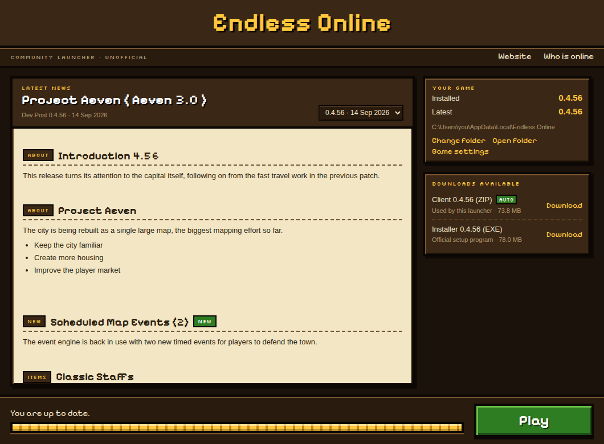
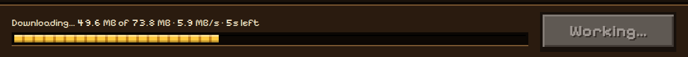

<div align="center">


# Endless Online Launcher

**An unofficial, open source launcher and auto-updater for [Endless Online](https://www.endless-online.com/).**

One button to install, update and play. Your saved logins and settings survive every update.

[](https://github.com/Keiirron/endless-online-launcher/releases/latest)
[](LICENSE)
[](https://github.com/Keiirron/endless-online-launcher/actions)



</div>

## Download

Grab **EO-Community-Launcher-Setup** from the [latest release](https://github.com/Keiirron/endless-online-launcher/releases/latest) and run it.

> Windows may show a "Windows protected your PC" prompt because the installer isn't code-signed. Choose **More info → Run anyway**.
>
> To verify a download, compare its SHA-256 with `SHA256SUMS.txt` on the release: `Get-FileHash .\EO-Community-Launcher-Setup-x.y.z.exe`

## Features

| | |
|---|---|
| **Auto-update** | Checks the official site for the newest client and updates with one click. |
| **Keeps your logins** | Saved logins, screenshots and chat logs are never touched. The updater never deletes anything. |
| **Smart config merge** | New settings from an update arrive, your own values are kept. Configs are backed up first. |
| **Latest dev post** | Read the newest dev post right in the launcher, older ones in a dropdown. |
| **Progress** | Download speed, time left, then unpack and install progress. |
| **Updates itself** | The launcher checks GitHub for a newer version of itself and offers to restart when it's ready. |
| **Program Files friendly** | Can move a protected install to a per-user folder and bring your data across. |

<div align="center"></div>

## How your settings are kept

The config file shipped with the update is used as the base, so new settings and sections arrive intact. Then your values go back on top.

The launcher also remembers what each version shipped. That lets it tell *"you changed this"* (keep yours) from *"you never touched this and the developers changed the default"* (take theirs, for example a new server address). Every config it changes is copied to `.launcher/backups` first, and the last five backups are kept.

The client is only ever downloaded from `endless-online.com`.

## Build it yourself

Needs [Node.js](https://nodejs.org) 18 or newer.

```
npm install
npm start        run the launcher
npm test         run the tests
npm run dist     build the installer into dist/
```

On Windows you can also double-click `run.bat` or `build.bat`.

<details>
<summary>Project layout</summary>

```
main.js            Electron main process
preload.js         safe bridge to the UI
src/site.js        reads downloads and dev posts from endless-online.com
src/updater.js     download, unzip, apply, backup, migrate
src/iniMerge.js    key-level 3-way INI merge
renderer/          the UI
test/              automated tests
```

</details>

## Releasing

1. Add a section for the new version at the top of `CHANGELOG.md`.
2. Double-click `release.bat` and type the version (for example `0.1.2`).

It commits, tags and pushes. GitHub then builds the installer and publishes the release with that changelog section as the notes, the checksum file, and the files the launcher's self-update needs. See [CHANGELOG.md](CHANGELOG.md) for history.

## Disclaimer

This is a fan project. It is not affiliated with or endorsed by the Endless Online developers. The Endless Online name, icon and game content belong to their owners. Fonts: Pixelify Sans and Silkscreen (SIL Open Font License).

## License

[MIT](LICENSE)
